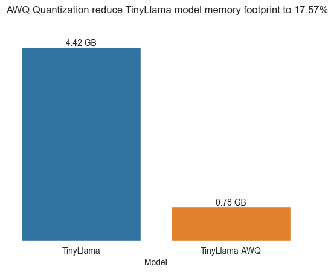

# LLM_quantize
This repository aims at accelerating the inference time of the TinyLlama-1.1B-Chat-v1.0 model.

**Quantized Model:** [tctsung/TinyLlama-1.1B-chat-v1.0-awq](https://huggingface.co/tctsung/TinyLlama-1.1B-chat-v1.0-awq)

## Introduction

This repository focuses on applying AWQ quantization. It also covers the preparation of the calibration dataset with the help of LLM (Gemini-pro), and the evaluation of the model's performance and inference speed after quantization.


**Key Results:**

1. AWQ quantization resulted in a **1.62x improvement** in inference speed, generating **140.47 new tokens per second**.
2. The model size was compressed from 4.4GB to 0.78GB, representing a reduction in memory footprint to only **17.57%** of the original model.

 


3. We used 6 different LLM tasks to demonstrate that the quantized model maintains similar accuracy, with a maximum accuracy degradation of only ~1%


## Inference tutorial

The vllm package is recommended for running AWQ models. However, it currently only supports Linux systems. Mac and Windows users can utilize tools like WSL2 to run inference on their GPUs within a virtual machine environment.

**Note:** While the `AutoModelForCausalLM` module in Hugging Face Transformers library is capable to run AWQ models, I observed that it resulted in **slower inference speeds** than the original model. Therefore I highly recommend using the vllm package for running AWQ models


```python
from vllm import LLM, SamplingParams
from transformers import AutoTokenizer

# load model & tokenizer:
model_id = "tctsung/TinyLlama-1.1B-chat-v1.0-awq"
model = LLM(model = model_id, dtype='half', 
            quantization='awq', gpu_memory_utilization=0.9)
sampling_params = SamplingParams(temperature=1.0,
                                 max_tokens=1024,
                                 min_p=0.5,
                                 top_p=0.85)
tokenizer = AutoTokenizer.from_pretrained(model_id)

# define your own sys & user msg:
sys_msg = "..."
user_msg = "..."
chat_msg = [
            {"role": "system", "content": sys_msg},
            {"role": "user",  "content": user_msg}
        ]
input_text = tokenizer.apply_chat_template(chat_msg, tokenize=False, add_generation_prompt=False)  
output = model.generate(input_text, sampling_params)
output_text = output[0].outputs[0].text
print(output_text)   # show the model output
```

## Scripts & notebook

### [calib_data_prep.ipynb](calib_data_prep.ipynb)

This notebook utilizes the Gemini model to build a chat calibration dataset. 

The generated data can be found in [data\restaurant_chat_2024-05-11_21_38_18_603307.csv](data\restaurant_chat_2024-05-11_21_38_18_603307.csv)


### [run_awq.py](scripts/run_awq.py)

This script performs AWQ quantization on the TinyLlama-1.1B-Chat-v1.0 model using the autoawq package.

* Reference model: TinyLlama/TinyLlama-1.1B-Chat-v1.0
* Quantized model: [tctsung/TinyLlama-1.1B-chat-v1.0-awq](https://huggingface.co/tctsung/TinyLlama-1.1B-chat-v1.0-awq)

### [speed_eval_Colab.ipynb](speed_eval_Colab.ipynb)

This Colab notebook executes the [scripts/speed_eval.py](scripts/speed_eval.py) script to calculate the model's inference speed. This requires Colab due to the script's dependency on the vllm package.

The output can be found at `evaluation/<model>/<model name>_speed.csv`

### [evaluation.ipynb](evaluation.ipynb)

This notebook contains code for all data visualizations and model performance evaluation using the `lm-evaluation-harness` package.

The evaluation results can be found in [evaluation/TinyLlama/results.json](evaluation/TinyLlama/results.json) and [evaluation/TinyLlama_AWQ/results.json](evaluation/TinyLlama_AWQ/results.json)

```
# For Tinyllama:
lm_eval \
    --model hf \
    --model_args pretrained=TinyLlama/TinyLlama-1.1B-Chat-v1.0,dtype="float" \
    --tasks hellaswag,openbookqa,winogrande,arc_easy,arc_challenge,boolq \
    --output evaluation/TinyLlama/ \
    --device cuda:0 --batch_size 32

# For Tinyllama AWQ:
lm_eval \
    --model hf \
    --model_args pretrained=tctsung/TinyLlama-1.1B-chat-v1.0-awq \
    --tasks hellaswag,openbookqa,winogrande,arc_easy,arc_challenge,boolq \
    --output evaluation/TinyLlama_AWQ/ \
    --device cuda:0 --batch_size 32
```